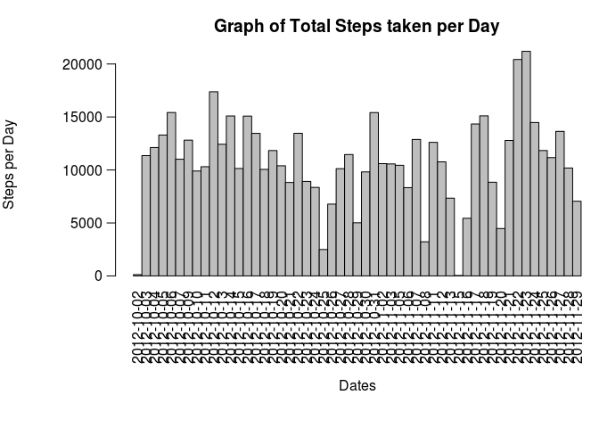
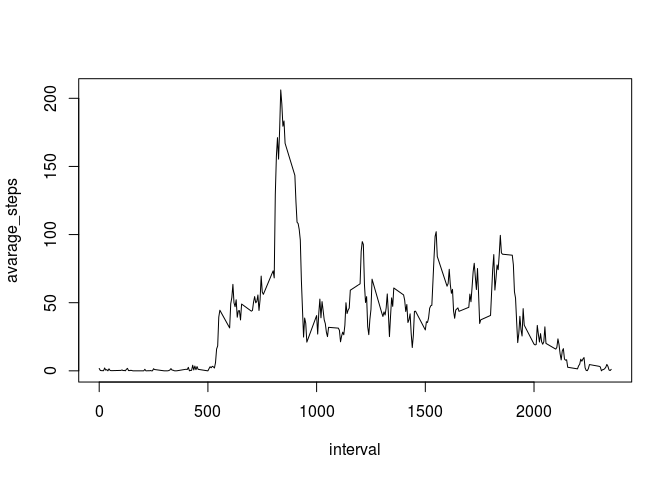
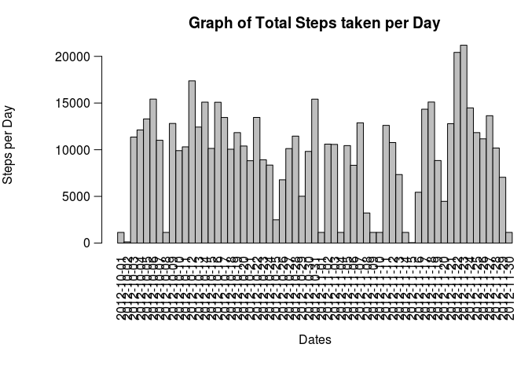
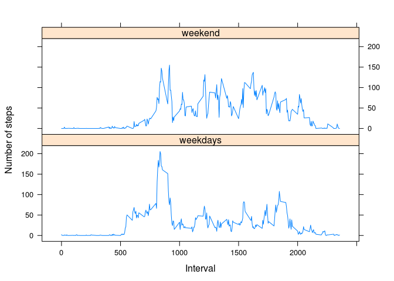

# Reproducible Research: Peer Assessment 1

##Loading and preprocessing the data


```r
setwd("/home/srivasan/reproducible research")
data1<-read.csv("activity.csv")
data<-read.csv("activity.csv")
```

## What is mean total number of steps taken per day?


```r
library(data.table)
date<-unique(data$date)
data<-subset(data,data$steps!='NA')
dt<-data.table(data)
dt2<-dt[,list(steps=sum(steps)),by="date"]
head(dt2)
```

```
##          date steps
## 1: 2012-10-02   126
## 2: 2012-10-03 11352
## 3: 2012-10-04 12116
## 4: 2012-10-05 13294
## 5: 2012-10-06 15420
## 6: 2012-10-07 11015
```


```r
#steps<-dt2$steps
#hist(steps,col="green")
with(dt2, {
    par(oma=c(2,0,0,0), mar=c(6.75,6.75,3,0), mgp=c(5.75,0.75,0), las=2)
    barplot(
      height=steps,
      main="Graph of Total Steps taken per Day",
      xlab="Dates",
      ylab="Steps per Day",
      names.arg=date,
      space=c(0)
    )
})
```

 


```r
dt3<-dt[,list(steps=mean(steps)),by="date"]
head(dt3)
```

```
##          date    steps
## 1: 2012-10-02  0.43750
## 2: 2012-10-03 39.41667
## 3: 2012-10-04 42.06944
## 4: 2012-10-05 46.15972
## 5: 2012-10-06 53.54167
## 6: 2012-10-07 38.24653
```


```r
dt4<-dt[,list(steps=median(steps)),by="date"]
head(dt4)
```

```
##          date steps
## 1: 2012-10-02     0
## 2: 2012-10-03     0
## 3: 2012-10-04     0
## 4: 2012-10-05     0
## 5: 2012-10-06     0
## 6: 2012-10-07     0
```

##What is the average daily activity pattern?


```r
avarage_steps<-tapply(data1$steps,data1$interval,mean,na.rm=TRUE)
interval<-unique(data1$interval)
plot(interval,avarage_steps,type="l")
```

 

```r
head(avarage_steps)
```

```
##         0         5        10        15        20        25 
## 1.7169811 0.3396226 0.1320755 0.1509434 0.0754717 2.0943396
```

###Avarage daily pattern


```r
head(dt)
```

```
##    steps       date interval
## 1:     0 2012-10-02        0
## 2:     0 2012-10-02        5
## 3:     0 2012-10-02       10
## 4:     0 2012-10-02       15
## 5:     0 2012-10-02       20
## 6:     0 2012-10-02       25
```

```r
max_steps<-max(dt$steps)
a<-which(dt$steps %in% max_steps)
a1<-dt$interval[a]
a2<-dt$date[a]
data.frame(steps=max_steps,date=a2,interval=a1)
```

```
##   steps       date interval
## 1   806 2012-11-27      615
```

##Input Missing Values


```r
l1<-length(data1$steps)
l2<-length(na.omit(data1$steps))
l3<-l1-l2
l3
```

```
## [1] 2304
```


```r
a1<-as.numeric()
b<-split(data$steps,data$interval)
for(i in 1:288)
{
q<-as.numeric(unlist(b[i]))
a1[i]<-median(q)
}
head(b)
```

```
## $`0`
##  [1]  0  0 47  0  0  0  0 34  0  0  0  0  0  0  0  0  0  0  0 10  0  0  0
## [24]  0  0  0  0  0  0  0  0  0  0  0  0  0  0  0  0  0  0  0  0  0  0  0
## [47]  0  0  0  0  0  0  0
## 
## $`5`
##  [1]  0  0  0  0  0  0  0 18  0  0  0  0  0  0  0  0  0  0  0  0  0  0  0
## [24]  0  0  0  0  0  0  0  0  0  0  0  0  0  0  0  0  0  0  0  0  0  0  0
## [47]  0  0  0  0  0  0  0
## 
## $`10`
##  [1] 0 0 0 0 0 0 0 7 0 0 0 0 0 0 0 0 0 0 0 0 0 0 0 0 0 0 0 0 0 0 0 0 0 0 0
## [36] 0 0 0 0 0 0 0 0 0 0 0 0 0 0 0 0 0 0
## 
## $`15`
##  [1] 0 0 0 0 0 0 0 0 8 0 0 0 0 0 0 0 0 0 0 0 0 0 0 0 0 0 0 0 0 0 0 0 0 0 0
## [36] 0 0 0 0 0 0 0 0 0 0 0 0 0 0 0 0 0 0
## 
## $`20`
##  [1] 0 0 0 0 0 0 0 0 0 0 0 0 0 0 0 0 0 0 0 0 4 0 0 0 0 0 0 0 0 0 0 0 0 0 0
## [36] 0 0 0 0 0 0 0 0 0 0 0 0 0 0 0 0 0 0
## 
## $`25`
##  [1]  0  0  0  0  0  0 13  0  0  0  0 52 35  0  0 11  0  0  0  0  0  0  0
## [24]  0  0  0  0  0  0  0  0  0  0  0  0  0  0  0  0  0  0  0  0  0  0  0
## [47]  0  0  0  0  0  0  0
```

```r
a1
```

```
##   [1]  0  0  0  0  0  0  0  0  0  0  0  0  0  0  0  0  0  0  0  0  0  0  0
##  [24]  0  0  0  0  0  0  0  0  0  0  0  0  0  0  0  0  0  0  0  0  0  0  0
##  [47]  0  0  0  0  0  0  0  0  0  0  0  0  0  0  0  0  0  0  0  0  0  0  0
##  [70]  0  0  0  0  0  0  0  0  0  0  0  0  0  8 13  7 13 14  0  0 12  0  0
##  [93] 15 19 19 28 41 25 32 13 45 33 37 19 51 60 16 43 20  8 31 15 16  0  0
## [116]  0  0  0  0  0  0  0  0  0  0  0  0  0  0  0  0  0  0  0  0  0  0  0
## [139]  0  0  0  0  0  0  0  0  6 10  0  0  0  0  0  0  0  0  0  0  0  0  0
## [162]  0  0  0  0  0  0  0  0  0  0  0  0  0  0  0  0  0  0  0  0  0  0  0
## [185]  0  0  0  0  0  0  0  0  0  0  0  0  0  0  0  0  0  0  0  0  0  0  0
## [208]  7  7  0  7  7 26  7  0 10 15 18 26 25 24  9 33 26 34 42 33 30 33 30
## [231]  8  8  7  0  0  0  0  0  0  0  0  0  0  0  0  0  0  0  0  0  0  0  0
## [254]  0  0  0  0  0  0  0  0  0  0  0  0  0  0  0  0  0  0  0  0  0  0  0
## [277]  0  0  0  0  0  0  0  0  0  0  0  0
```


```r
head(data1)
```

```
##   steps       date interval
## 1    NA 2012-10-01        0
## 2    NA 2012-10-01        5
## 3    NA 2012-10-01       10
## 4    NA 2012-10-01       15
## 5    NA 2012-10-01       20
## 6    NA 2012-10-01       25
```

```r
data1[is.na(data1)]<-a1[1:288]
head(data1)
```

```
##   steps       date interval
## 1     0 2012-10-01        0
## 2     0 2012-10-01        5
## 3     0 2012-10-01       10
## 4     0 2012-10-01       15
## 5     0 2012-10-01       20
## 6     0 2012-10-01       25
```


```r
#new_sum<-tapply(data1$steps,data1$date,s
#hist(new_sum)
new_sum<-aggregate(data1$steps,by=list(data1$date),FUN=sum)
with(new_sum, {
    par(oma=c(2,0,0,0), mar=c(6.75,6.75,3,0), mgp=c(5.75,0.75,0), las=2)
    barplot(
      height=x,
      main="Graph of Total Steps taken per Day",
      xlab="Dates",
      ylab="Steps per Day",
      names.arg= Group.1,
      space=c(0)
    )
})
```

 

```r
new_mean<-tapply(data1$steps,data1$date,mean)
head(new_mean)
```

```
## 2012-10-01 2012-10-02 2012-10-03 2012-10-04 2012-10-05 2012-10-06 
##   3.961806   0.437500  39.416667  42.069444  46.159722  53.541667
```

```r
new_median<-tapply(data1$steps,data1$date,median)
head(new_median)
```

```
## 2012-10-01 2012-10-02 2012-10-03 2012-10-04 2012-10-05 2012-10-06 
##          0          0          0          0          0          0
```

##Are there differences in activity patterns between weekdays and weekends?


```r
days<-as.Date(data1$date)
week_days<-weekdays(days)
week<-replace(week_days,week_days=="Sunday"|week_days=="Saturday","weekend")
week<-replace(week,week_days=="Monday"|week_days=="Tuesday"|week_days=="Wednesday"|week_days=="Thursday"|week_days=="Friday","weekdays")
w<-data.frame(data=data1,week=week)
head(w)
```

```
##   data.steps  data.date data.interval     week
## 1          0 2012-10-01             0 weekdays
## 2          0 2012-10-01             5 weekdays
## 3          0 2012-10-01            10 weekdays
## 4          0 2012-10-01            15 weekdays
## 5          0 2012-10-01            20 weekdays
## 6          0 2012-10-01            25 weekdays
```


```r
step_taken<-tapply(data1$steps,data1$interval,mean)
head(step_taken)
```

```
##          0          5         10         15         20         25 
## 1.49180328 0.29508197 0.11475410 0.13114754 0.06557377 1.81967213
```

```r
weektype_plot<-aggregate(data=data1,steps~week + interval,FUN=mean)
library("lattice")
xyplot(
    type="l",
    data=weektype_plot,
    steps ~ interval | week,
    xlab="Interval",
    ylab="Number of steps",
    layout=c(1,2)
)
```

 
